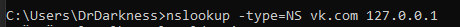
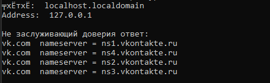
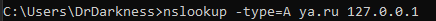
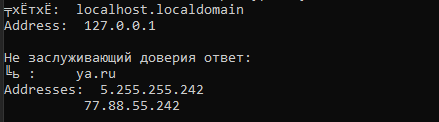

# Кэширующий DNS сервер #
## Постановка задачи: ##
Сервер прослушивает 53 порт по протоколу UPD. При получении запроса сервер проверяет кэш на наличие ответа на этот запрос. Если в кэше ответ отсутствует, то сервер отправляет этот запрос на другой DNS сервер от Google. Получив ответ, сервер добавляет его в кэш. Далее ответ отправляется клиенту.
## Использование: ##
Для работы сервера требуется лишь запустить файл "___dns_server.py___"
~~~
python dns_server.py
~~~
## Видео пример запуска сервера: ##
+ https://youtu.be/JvjdmeKukD8  
## Примеры работы: ##
__Отправляем запрос на получение ресурсной записи типа "NS"__   
  
__Получим следующий ответ:__  
  
__Отправляем запрос на получение ресурсной записи типа "A"__
  
__Получим следующий ответ:__  

___Задачу выполнил: Матус Матвей КН-201 (МЕН-210201)___